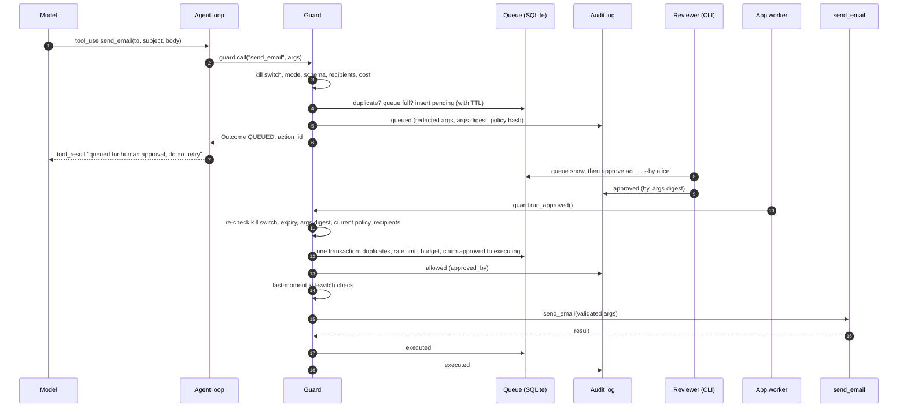

# agent-guardrails

Controls for AI agents that send, book, update or spend: allow / draft / approve
modes, execution-time re-validation, idempotency, a tamper-evident audit log and a
kill switch. Small, framework-agnostic Python.

**Read freely, write carefully.**

[](https://github.com/dsugurtuna/agent-guardrails/actions/workflows/ci.yml)


## The problem

Agents are being given tools with side effects: send an email, create a calendar
event, update a record, spend credits. The model that decides when to call them can be
wrong, confused, or steered by text it reads (prompt injection). In most agent code
the tool call goes straight through, so nothing stands between "the model asked" and
"it happened": no allow-list, no human check, no spend limit, no protection against a
retry sending the same message twice, and no record anyone could rely on afterwards.

## What this does

Every tool call goes through a `Guard`, which applies a declarative policy:

| Control | What it does |
|---|---|
| **Modes per tool** | `allow` (run now), `draft` (never run; return a preview), `approve` (queue for a human), `block`. Tools not in the policy are blocked. |
| **Argument schemas** | Validated before anything happens; unknown arguments are rejected. |
| **Recipient allow-lists** | Allowed domains and a maximum recipient count; ambiguous addresses are refused, not guessed at. |
| **Rate limits and budgets** | Calls per tool per window; spend per agent per window. Checked and reserved in one SQLite transaction, so they hold across threads and worker processes sharing the database. |
| **Durable approval queue** | SQLite: pending, approved, rejected, expired, executed. Approvals have a time-to-live. |
| **Execution-time re-validation** | An approved action is re-checked against the *current* policy, allow-list, budget, kill switch and expiry, and its arguments must still match what was approved. |
| **Idempotency** | Identical actions (normalised arguments) within a window are not repeated, so a retrying agent cannot send the same reminder twice. |
| **Tamper-evident audit log** | Append-only JSONL, each record carrying the SHA-256 of the previous one. `verify` detects edits, deletions, insertions and reordering; with an anchor kept elsewhere (`audit head`), also removal of the newest records and whole-file rewrites. Secrets are redacted. |
| **Kill switch** | Environment variable, flag file or API. Blocks everything, including approved actions. |
| **Model-friendly results** | Every call returns an `Outcome` whose text tells the model what happened ("queued for human approval, do not retry"). |
| **Claude adapter** (optional) | Runs guarded tools inside a Claude tool-use loop and returns sensible `tool_result` blocks. |
| **CLI** | `agent-guardrails queue list/show/approve/reject`, `audit verify/head`, `kill on/off/status`. |

## Quickstart

Not yet published to PyPI; install from source (Python 3.11+):

```bash
git clone https://github.com/dsugurtuna/agent-guardrails.git
cd agent-guardrails
python -m venv .venv && source .venv/bin/activate
pip install -e ".[dev]"

python examples/email_calendar_assistant.py   # offline demo, no model or network
pytest                                         # offline, no API keys
```

The demo drives a generic email and calendar assistant against a fake backend.
Condensed output from one run (action ids, timestamps and hashes differ per run):

```text
1. Read the calendar (allow)                                   -> EXECUTED
2. Create an event (allow, within limits)                      -> EXECUTED
3. Draft a reply (draft: nothing is sent)                      -> DRAFTED
4. Email the team (approve: queued for a human)                -> QUEUED
5. The agent retries the same email (duplicate)                -> DUPLICATE
6. Email an outside address (blocked: domain not allow-listed) -> BLOCKED [recipient_not_allowed]
7. Delete an event (blocked by policy)                         -> BLOCKED [tool_blocked]
   -- a reviewer approves the queued email --
8. Execute approved email                                      -> EXECUTED
9. The agent retries again after it was sent (duplicate)       -> DUPLICATE
10.1-10.3 Send three SMS against a budget of 2                 -> EXECUTED, EXECUTED, BLOCKED [budget_exceeded]
   -- an operator engages the kill switch --
12. Worker tries the approved follow-up                        -> BLOCKED [kill_switch]
13. Agent tries to read the calendar                           -> BLOCKED [kill_switch]
Audit log: 25 records; chain intact: True
Edited copy verifies: False (line 5: record hash does not match its content)
Emails actually sent: ['Reminder: project sync at 10:00']
```

Run `python examples/email_calendar_assistant.py --home ./demo-state` to keep the state,
then inspect it with `agent-guardrails --home ./demo-state queue list -s all`.

### In your own code

```python
from agent_guardrails import Guard, Policy

policy = Policy.from_yaml("""
tools:
  list_events: {mode: allow}
  send_email:
    mode: approve
    recipients: {fields: [to], allowed_domains: [example.com]}
""")
guard = Guard(policy)  # state lives in ./.agent-guardrails, shared with the CLI


@guard.tool()
def list_events(day: str) -> list[str]:
    return ["09:00 stand-up"]  # your real calendar call


@guard.tool()
def send_email(to: list[str], subject: str, body: str) -> str:
    return "sent"  # your real mail call


print(list_events("2026-10-01").as_tool_result())
# OK: 'list_events' was executed (action_id=act_...). Result: ["09:00 stand-up"]
print(send_email(["sam@example.com"], "Sync", "See you at 10").as_tool_result())
# QUEUED FOR HUMAN APPROVAL: 'send_email' has NOT been performed yet (action_id=act_...) ...
print(send_email(["sam@partner.test"], "Sync", "See you at 10").as_tool_result())
# BLOCKED BY POLICY (recipient_not_allowed): recipient domain not on the allow-list ...
```

A reviewer, in another terminal:

```bash
agent-guardrails queue list
agent-guardrails queue show act_...            # full arguments, before deciding
agent-guardrails queue approve act_... --by alice
agent-guardrails audit head                     # keep the "anchor" value somewhere else
agent-guardrails audit verify --anchor 12:9f...  # later: the log still starts with those records
```

Back in the application, which holds the credentials and the tool functions:

```python
for outcome in guard.run_approved():  # re-validates each action, then runs it
    print(outcome.as_tool_result())
```

### With Claude

```bash
pip install -e ".[anthropic]"
```

```python
import anthropic
from agent_guardrails.adapters.claude import run_tool_loop, tool_definition

send_email_tool = tool_definition(
    policy,
    "send_email",
    "Send an email. A human approves it before it is sent.",
    input_schema={  # or omit, and give the tool an `args` schema in the policy
        "type": "object",
        "properties": {
            "to": {"type": "array", "items": {"type": "string"}},
            "subject": {"type": "string"},
            "body": {"type": "string"},
        },
        "required": ["to", "subject", "body"],
    },
)
result = run_tool_loop(
    anthropic.Anthropic(),
    guard,
    messages=[{"role": "user", "content": "Email Sam about tomorrow's sync"}],
    tools=[send_email_tool],
)
print(result.text, [str(o.status) for o in result.outcomes])
```

`run_tool_loop` defaults to `claude-opus-5-5`, sends every `tool_use` block through the
guard, returns all results in one message, flags blocked and failed calls with
`is_error`, never runs tools on a `refusal` or on a `max_tokens` stop part-way through a
tool call, and opts into server-side refusal fallbacks (`fallbacks="default"`); pass
`server_side_fallback=False` to use the plain Messages endpoint. See
[`examples/claude_assistant.py`](examples/claude_assistant.py) (needs credentials; the
tests use a fake client).

## How it works

An approve-mode action, from the model's request to execution:



For `allow` mode the same checks run in one pass and the tool runs immediately; for
`draft` mode the tool never runs and a preview comes back instead. The full order of
checks and every policy field are in [`docs/POLICY.md`](docs/POLICY.md).

## Design decisions

The short version; [`docs/WHY.md`](docs/WHY.md) gives the reasoning for each.

- **Deny by default.** Unknown tools are blocked, and `default_mode: allow` is refused.
  Unattended execution is granted per tool, in writing.
- **Draft is its own mode.** "Prepare but don't send" is often the right answer, and it
  gives a tired reviewer nothing to wave through.
- **Re-validate at execution, not only at request.** Approval and execution happen at
  different times; the action must still be acceptable when it runs.
- **Approve exact arguments.** An approval is bound to a digest of the arguments. If the
  stored arguments differ, or the current schema would change them, it does not run.
- **Outcomes, not exceptions.** The agent loop needs something to tell the model.
- **SQLite with one check-and-reserve transaction.** Limits hold under concurrency with
  nothing extra to deploy.
- **Hash chain plus an anchor.** Detects edits without keys or services; keep the output
  of `audit head` elsewhere and check against it later (`audit verify --anchor`) to
  catch truncation or a full rewrite, even after the log has grown.
- **Deciding is separate from doing.** The CLI records decisions and never runs tools;
  the application that holds the credentials runs approved actions.

## Limitations and what this is not

- **It does not stop prompt injection.** It limits what an injected request can *do*.
  A manipulated model can still ask for harmful things and say misleading things.
- **It does not judge content.** An email with wrong content to an allowed colleague
  passes; that is what `approve` mode and reviewers are for.
- **It only guards what goes through it.** An agent with raw credentials, a shell or a
  general code-execution tool can bypass it.
- **It is not tamper-proof against someone who controls the host.** It makes tampering
  detectable (with an external anchor for the audit log), not impossible.
- **The CLI does not authenticate reviewers.** `--by` is recorded as given.
- **De-duplication is literal.** A reworded retry is a new action.
- **Synchronous only** for now; async tool functions are refused with a clear error.
- **Alpha.** The API may change before 1.0.

The full list, with the threats it does address, is in
[`docs/THREAT-MODEL.md`](docs/THREAT-MODEL.md). It includes a mapping to the OWASP Top 10
for LLM Applications 2025 (LLM06:2025 Excessive Agency, LLM10:2025 Unbounded
Consumption and others), with the 2026 edition's IDs alongside. Unofficial; not OWASP
or government guidance.

## Roadmap

- Async support with the same ordering guarantees.
- Signed approvals that can be verified independently of the database.
- A hook to ship audit anchors to external storage.
- "First contact" rules: a new recipient needs approval even for an allowed tool.
- More adapters, each tested against a fake client.
- A summary report from the audit log (decisions by reason, approval latency, reject rate).

## Project layout

```text
src/agent_guardrails/
  policy.py           Policy, ToolPolicy and YAML loading
  guard.py            Guard.call, wrap/@guarded, approvals, execution-time re-validation
  checks.py           argument, recipient and cost checks (stateless)
  store.py            SQLite action store and approval queue
  audit.py            hash-chained JSONL audit log and verifier
  killswitch.py       kill switch (env var, flag file, API)
  outcomes.py         Outcome, Status, Reason
  cli.py              agent-guardrails command
  adapters/claude.py  Claude tool-use loop
examples/             offline email and calendar assistant, Claude variant, policy.yaml
docs/                 WHY.md, THREAT-MODEL.md, POLICY.md
tests/                unit, property-based (hypothesis), concurrency and end-to-end tests
```

## Licence

Apache-2.0. See [LICENSE](LICENSE).

---

Personal project by [Ugur Tuna](https://github.com/dsugurtuna). Not affiliated with or endorsed by any employer.
